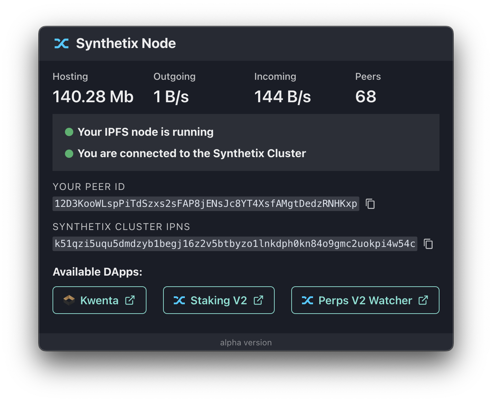

# Synthetix Node

[](https://dl.circleci.com/status-badge/redirect/gh/Synthetixio/synthetix-node/tree/master)



The Synthetix ecosystem has been progressively moving towards reliance on ENS/IPFS over DNS/HTTP for web hosting. For example, Kwenta is available via [eth.limo](http://eth.limo) at [kwenta.eth.limo](https://kwenta.eth.limo), and you can access it directly in [Brave](https://brave.com) or [Opera](https://www.opera.com) at [kwenta.eth](http://kwenta.eth). Synthetix’s Core Contributors are also using IPFS to store and share protocol deployment data using [Cannon](https://usecannon.com).

The Synthetix ecosystem has created an [IPFS Cluster](https://ipfscluster.io) to coordinate pinning these files.

_If you are involved in the Synthetix ecosystem and interested in pinning web apps (or any other data) in the cluster, start a discussion in the #dev-portal channel in the [Synthetix Discord server](https://discord.com/invite/AEdUHzt). Also, check out the [ipfs-deploy repository](https://github.com/Synthetixio/ipfs-deploy)._

## Why Run a Node?

You can support greater decentralization, reliability, performance, and censorship-resistance by running an IPFS node that follows the cluster. When using a pinned front-end, it will also load faster (as you’ll have the latest version available locally).

Anyone with a computer and an internet connection can join the swarm. It’s fine if you don’t have 100% uptime.

## Running the Node

On macOS, open your terminal and run the following command:

```sh
curl https://synthetixio.github.io/synthetix-node/install-macos.sh | bash
```

This will download the correct release of `SynthetixNode.app` to your Applications directory and start it.

### Manual Installation

Download the macOS app from the [Latest release page](https://github.com/Synthetixio/snx-node/releases/latest). (Windows and Linux versions are in development.) Select the ARM64 version if you are using a Mac with [Apple silicon](https://support.apple.com/en-us/HT211814).

Unzip and copy SynthetixNode to your Applications folder. There will be no pop-up to do so. Make sure to move it manually before proceeding to the next step.

Due to the latest MacOS security policies, it is no longer possible to execute unsigned apps. Therefore, you should clear the quarantine flag from the app before running it. Run the following command in terminal:

```sh
xattr -d com.apple.quarantine /Applications/SynthetixNode.app
```

### Build From Source Code

If you are concerned with security, clone this repository, review the implementation, and use the instructions below **Development** to start a development build.

If you would rather run this in a Docker container or run scripts manually, check out the [ipfs-follower repository](https://github.com/Synthetixio/ipfs-follower).

## Development

### Get Started

```sh
npm install
npm start
```

### Regenerate Electron app icons from svg

```sh
npm run iconsgen
```

### Releasing new version

```sh
pushd .
cd ./release/app
NEXT_VERSION=$(npm version patch)
popd
git add .
git commit -m $NEXT_VERSION
git tag -a -m $NEXT_VERSION $NEXT_VERSION
git push --follow-tags

# build app
export CSC_IDENTITY_AUTO_DISCOVERY=false
npm run package

# create release and upload artifacts
gh release create $NEXT_VERSION --generate-notes ./release/build/*.zip

# re-upload artifacts if needed
gh release upload $NEXT_VERSION ./release/build/*.zip
```

### Publishing new config

```sh
# 1. Ensure you have IPFS_USER and IPFS_PASS env vars set
export IPFS_USER=
export IPFS_PASS=

# 2. Use `synthetix-node-app-config` IPNS key
export IPNS_KEY=synthetix-node-app-config

# 3. Add and pin config.json to local IPFS node
export IPFS_CID=$(ipfs add --progress=false --pin=true --recursive --quieter config.json)

# 4. Pin config.json to Synthetix IPFS node
curl --silent --request POST --user "$IPFS_USER:$IPFS_PASS" "https://ipfs.synthetix.io:5001/api/v0/pin/add?recursive=true&progress=true&arg=$IPFS_CID" | jq

# 5. Publish config.json to Synthetix IPNS key
curl --silent --request POST --user "$IPFS_USER:$IPFS_PASS" "https://ipfs.synthetix.io:5001/api/v0/name/publish?key=$IPNS_KEY&arg=$IPFS_CID" | jq

# 6. Pin config.json to Synthetix IPFS Cluster
curl --silent --request POST --user "$IPFS_USER:$IPFS_PASS" "https://ipfs.synthetix.io/api/v0/pin/add?arg=$IPFS_CID"
```
